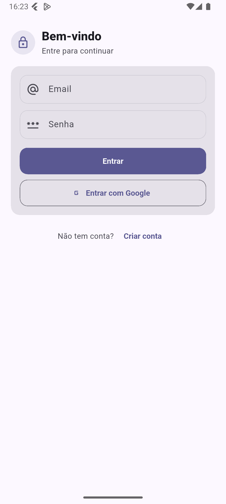
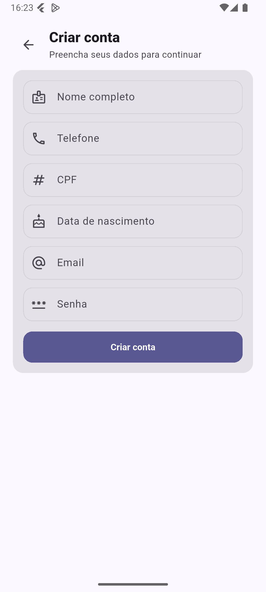
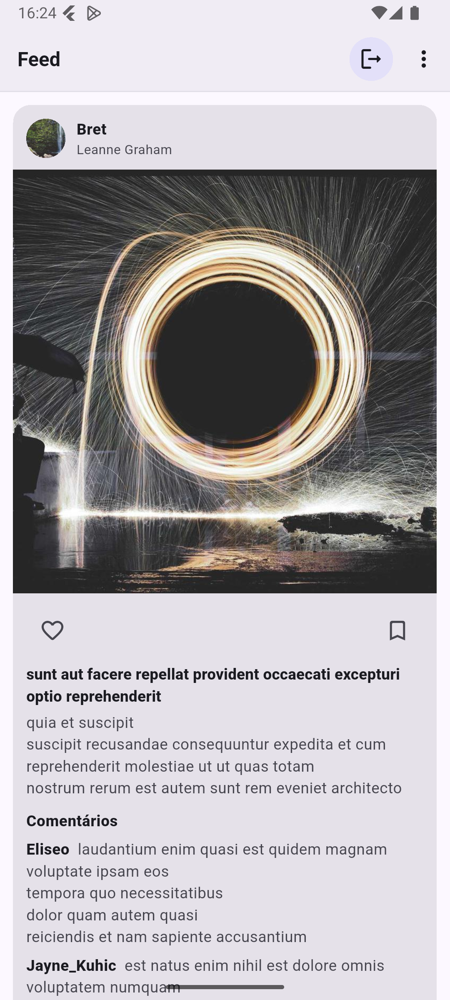

# Phone Validation App

Aplicativo Flutter desenvolvido com **GetX**, **Firebase Authentication** e **Cloud Firestore**.

Os dados são obtidos da API pública: https://jsonplaceholder.typicode.com/

O app demonstra autenticação com Firebase e um feed “estilo rede social” montado a partir do JSONPlaceholder.

## Features

### Splash
- Inicialização do app e roteamento para Login/Home

### Auth (Login / Register)
- Login com **email/senha**
- Cadastro com **validação de campos** (email, CPF, telefone, data, senha)
- Persistência do perfil no **Cloud Firestore**

### Home (Feed)
- Consome dados da API pública: `https://jsonplaceholder.typicode.com`
- Monta um feed visual combinando:
  - `/posts`
  - `/users`
  - `/photos`
  - `/comments`
- Cache de imagens com `cached_network_image`
- Ações estáticas de **like** e **save** (mudança de cor/ícone)
- Inicializa e dispara notificações locais via `flutter_local_notifications`
- Exemplos na Home: notificação imediata e agendada


## Arquitetura

- **Módulos** em `lib/modules/<module>/`
  - `bindings/`: DI com `Get.lazyPut`
  - `controllers/`: estado (Rx) + regras de tela
  - `services/`: integrações (API/Firebase/etc.)
  - `views/`: UI reativa

- **Core**
  - `core/ui/`: tema e dialogs
  - `core/validators/`: validações reutilizáveis (CPF/telefone/data/email)
  - `core/errors/` : mapper de erros do firebase auth


## Rotas

- `/splash` (Splash)
- `/login` (Login)
- `/register` (Cadastro)
- `/home` (Feed)

## Stack

- Flutter (SDK)
- Dart SDK: `^3.8.1`
- get: `^4.7.3`
- dio: `^5.9.1`
- cached_network_image: `^3.4.1`
- firebase_core: `^4.4.0`
- firebase_auth: `^6.1.4`
- cloud_firestore: `^6.1.2`
- flutter_local_notifications: `^20.0.0`
- google_sign_in: `^7.2.0`
- mask_text_input_formatter: `^2.9.0`

## Screenshots

- **Login**  

  

- **Cadastro**  

  

- **Home (Feed)**  

  


## Rodando o projeto

```bash
flutter pub get
flutter run
```


